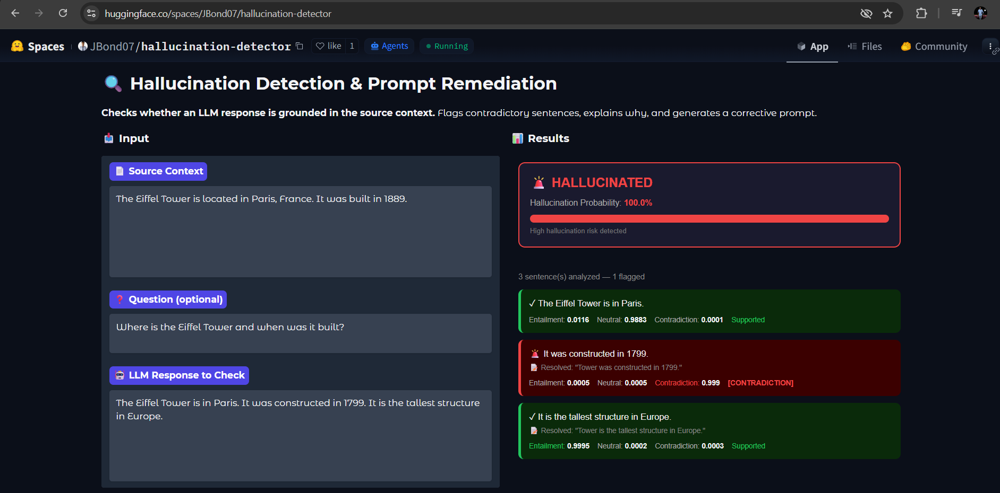
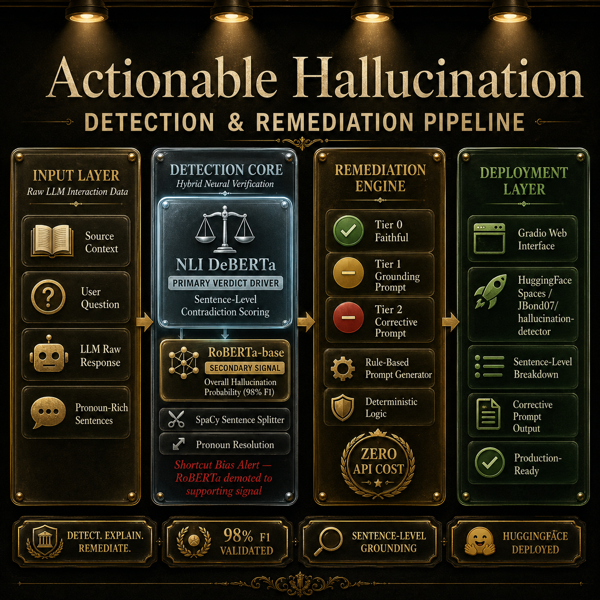
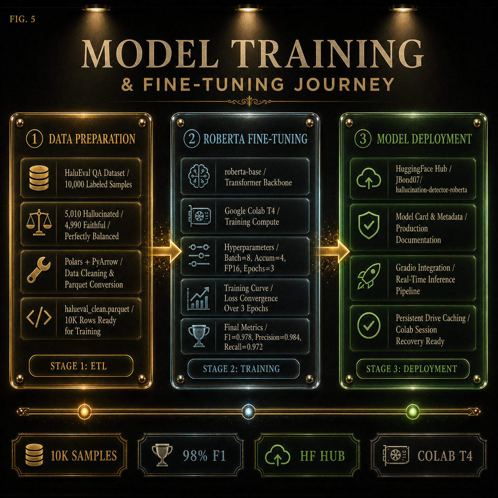
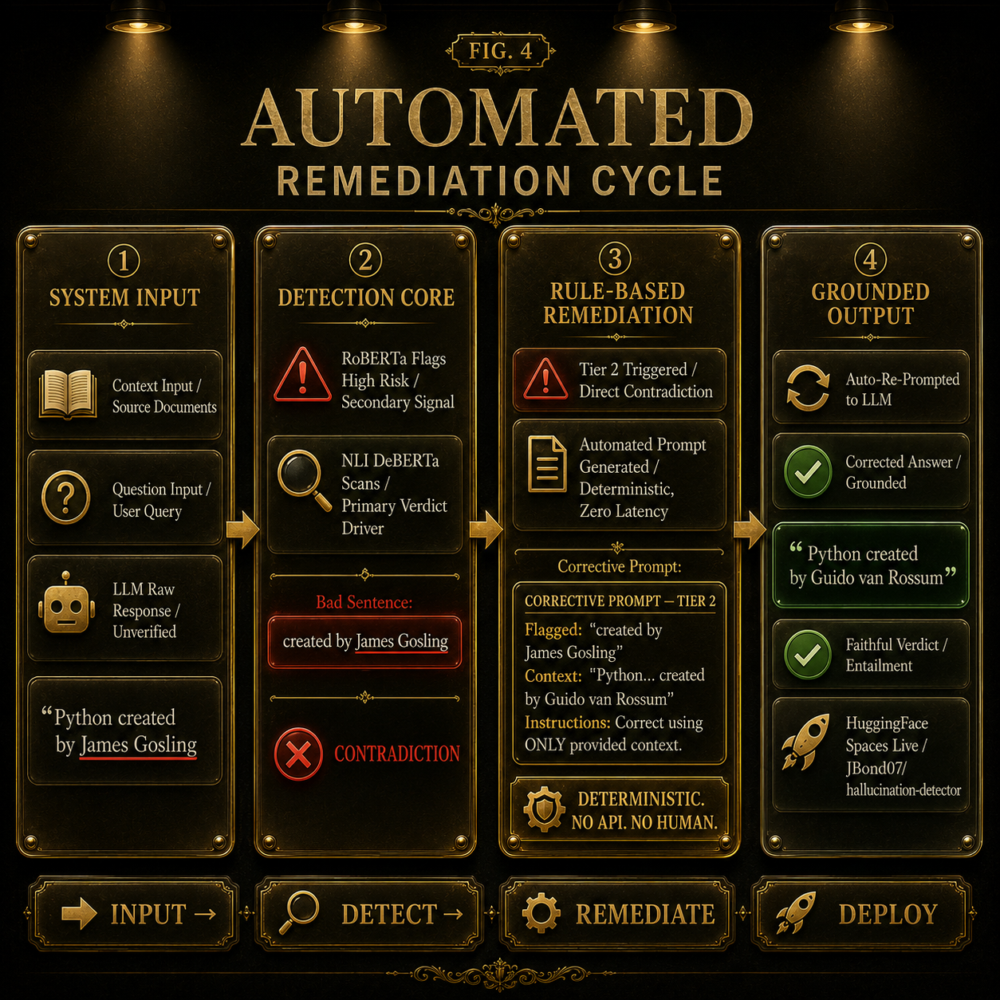
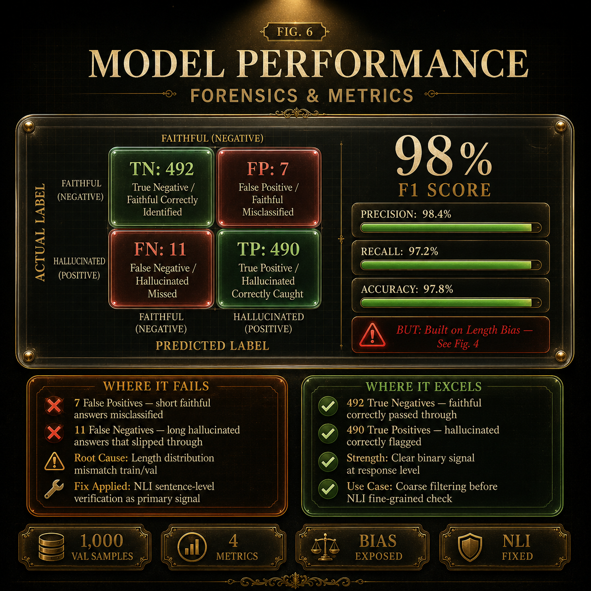

# 🔍 Hallucination Detection & Prompt Remediation System

[](https://huggingface.co/spaces/JBond07/hallucination-detector)
[](https://huggingface.co/JBond07/hallucination-detector-roberta)

> Production-grade hybrid NLP system that detects hallucinations in LLM outputs, explains exactly where the hallucination occurred, and generates corrective prompts for grounded regeneration.

---
# Hallucination Detection & Prompt Remediation System

> A hybrid NLP system that detects hallucinated LLM outputs, pinpoints the exact unsupported sentence, and generates corrective prompts for grounded regeneration.

---

## Live Demo

Try the deployed app here:  
[Hugging Face Space](https://huggingface.co/spaces/JBond07/hallucination-detector)

---

## Project Overview

Large Language Models can produce fluent answers that look correct but are factually wrong.  
This project solves that problem with a two-layer system:

- **Response-level hallucination detection** using a fine-tuned RoBERTa classifier
- **Sentence-level factual grounding** using DeBERTa NLI
- **Rule-based prompt remediation** to generate a better grounded response prompt

Instead of only saying “hallucinated” or “faithful,” the system explains:
- which sentence is wrong,
- why it is wrong,
- and how to correct it.

---

## 1) Full Pipeline Overview



This image shows the complete journey of the system:

1. User provides source context and LLM response  
2. RoBERTa estimates overall hallucination risk  
3. Response is split into sentences  
4. Pronouns are resolved for clearer meaning  
5. DeBERTa NLI checks each sentence against the source  
6. A remediation prompt is generated for unsupported or contradictory claims  
7. The final result is shown in the UI

This is not just a detector.  
It is a full **detect → explain → remediate** pipeline.

---

## Why This Project Matters

Hallucination is dangerous because the model sounds confident even when it is wrong.  
A simple classifier is not enough because it does not tell the user what failed.

This project fixes that by combining:
- factual verification,
- sentence-level debugging,
- and grounded prompt regeneration.

That makes the output useful instead of just analytical.

---

## Technology Stack

- **Python** — core implementation
- **PyTorch** — training and inference
- **Hugging Face Transformers** — RoBERTa and DeBERTa integration
- **SpaCy** — sentence splitting and pronoun handling
- **Polars / Parquet** — efficient dataset processing
- **Google Colab** — model training
- **Hugging Face Hub / Spaces** — model and app deployment
- **Gradio** — interactive interface

---

## Data and Model Training

### Dataset
The project uses **HaluEval QA data**, a labeled hallucination dataset with:
- faithful answers
- hallucinated answers

### Training Approach
A **RoBERTa-base** classifier was fine-tuned for response-level hallucination detection.

The input was designed as:
- **Context** = source document
- **Question + Response** = what the model answered

### Why this setup
Because hallucination is not just about whether the answer sounds good.  
It is about whether the answer is actually supported by the source.

### Training Outcome
The classifier achieved strong validation performance, but deeper analysis showed a hidden issue: shortcut learning.

---

## 2) RoBERTa Training & Fine-Tuning Journey



This diagram captures the model-building phase:
- data preparation
- tokenization
- fine-tuning
- validation
- deployment

The important lesson here is that high metrics alone do not guarantee real reasoning.  
A model can look strong on paper and still learn the wrong pattern.

---

## Working Mechanism

The system works in two stages:

### Stage 1: Overall response check
RoBERTa estimates whether the full response looks hallucinated.

### Stage 2: Sentence-level verification
Each sentence is checked independently against the source using NLI.

### Stage 3: Pronoun resolution
If a sentence starts with “it,” “they,” “he,” or “she,” the system resolves the subject before verification.

### Stage 4: Remediation
The system then generates a grounded prompt based on:
- unsupported claims
- contradictions
- faithful sentences

This makes the system actionable instead of just descriptive.

---

## 3) Shortcut Bias Discovery


This was the turning point of the project.

At first, RoBERTa achieved excellent accuracy and F1 score.  
But sentence-level testing exposed a serious issue: it was not truly learning factual correctness.

It was learning a shortcut:
- short answers often looked faithful
- long answers often looked hallucinated

So the model started using response length as a proxy for truth.

That is why threshold tuning alone could not fix it.  
Threshold changes the cutoff, not the learned representation.

This discovery forced a redesign of the architecture.

---

## The Biggest Problem

The biggest problem was **shortcut learning**.

A model can get very high scores while still failing on the actual task.  
That is exactly what happened here.

The detector appeared accurate, but it was biased toward:
- length
- surface pattern
- dataset artifacts

That would have made the remediation system unreliable if left unfixed.

---

## 4) Sentence-Level Factual Grounding


To solve shortcut bias, the system uses **DeBERTa NLI**.

Instead of judging the whole answer at once, it checks each sentence as a logical claim against the context.

NLI gives three signals:
- **Entailment** — supported by the source
- **Neutral** — not clearly supported or contradicted
- **Contradiction** — conflicts with the source

This is the correct tool for sentence-level verification because it answers the exact question:

> Does this sentence follow from the source context?

---

## Fixing the Biggest Problem

The fix was architectural, not cosmetic.

### What changed
- RoBERTa stayed as the overall response-level signal
- DeBERTa NLI became the primary sentence-level verifier
- Pronoun resolution was added to avoid ambiguity
- Only strong contradictions are flagged

### Why this works
Because the system no longer depends on a classifier that learned shortcuts.  
It now checks factual consistency directly.

---

## 5) Automated Remediation Cycle



Detection alone is not enough.  
The user needs a clear next step.

So the system generates a rule-based corrective prompt:

- **Tier 0** — no issue, no prompt
- **Tier 1** — unsupported statement, grounding prompt
- **Tier 2** — contradiction, corrective prompt

This is deterministic, fast, and free.  
No second LLM is needed to generate the fix.

---

## Confusion Matrix and Performance Forensics



The validation results were strong:
- **Accuracy:** 97.8%
- **F1 Score:** 97.8%
- **Precision:** 98.4%
- **Recall:** 97.2%

But the more important part is the forensic analysis:
- the model looked strong,
- yet it had a hidden bias,
- and the project caught that before deployment.

That is a better engineering outcome than blindly trusting metrics.

---

## Deployment

The project was deployed as an interactive Gradio app on Hugging Face Spaces.

Users can:
- enter source context
- paste an LLM response
- see hallucination risk
- inspect flagged sentences
- view confidence scores
- get a corrective prompt

The model artifact is hosted on Hugging Face Hub, and the app is accessible publicly.

---

## Repository Structure

```text
Hallucination-detector/
├── docs/
│   ├── full-pipeline-overview.png
│   ├── roberta-training-finetuning-journey.png
│   ├── shortcut-bias-discovery.png
│   ├── sentence-level-factual-grounding.png
│   ├── automated-remediation-cycle.png
│   └── confusion-matrix-performance-forensics.png
├── src/
├── configs/
├── README.md
├── requirements.txt
└── setup.sh
