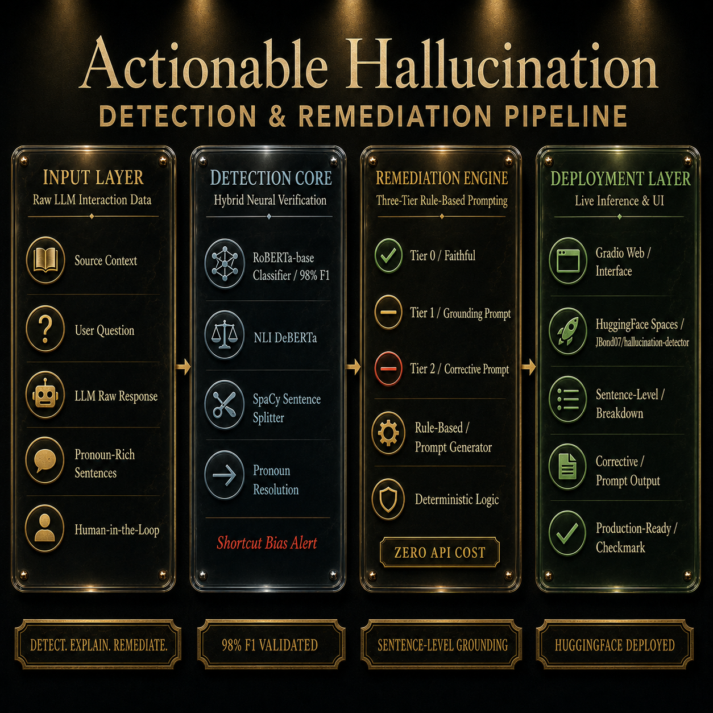
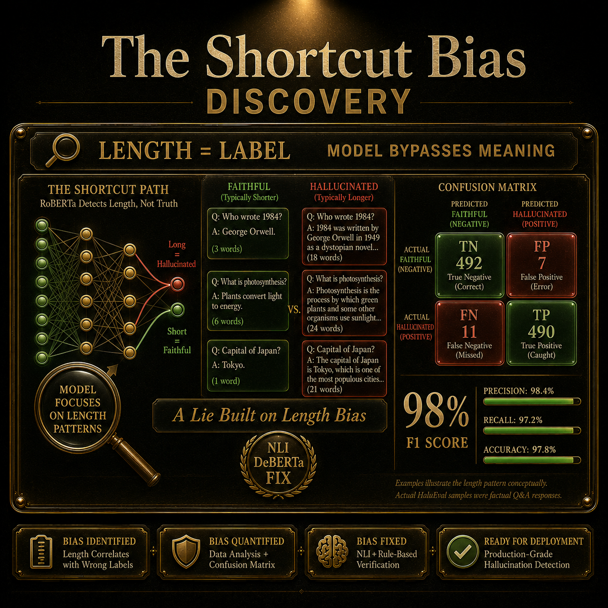
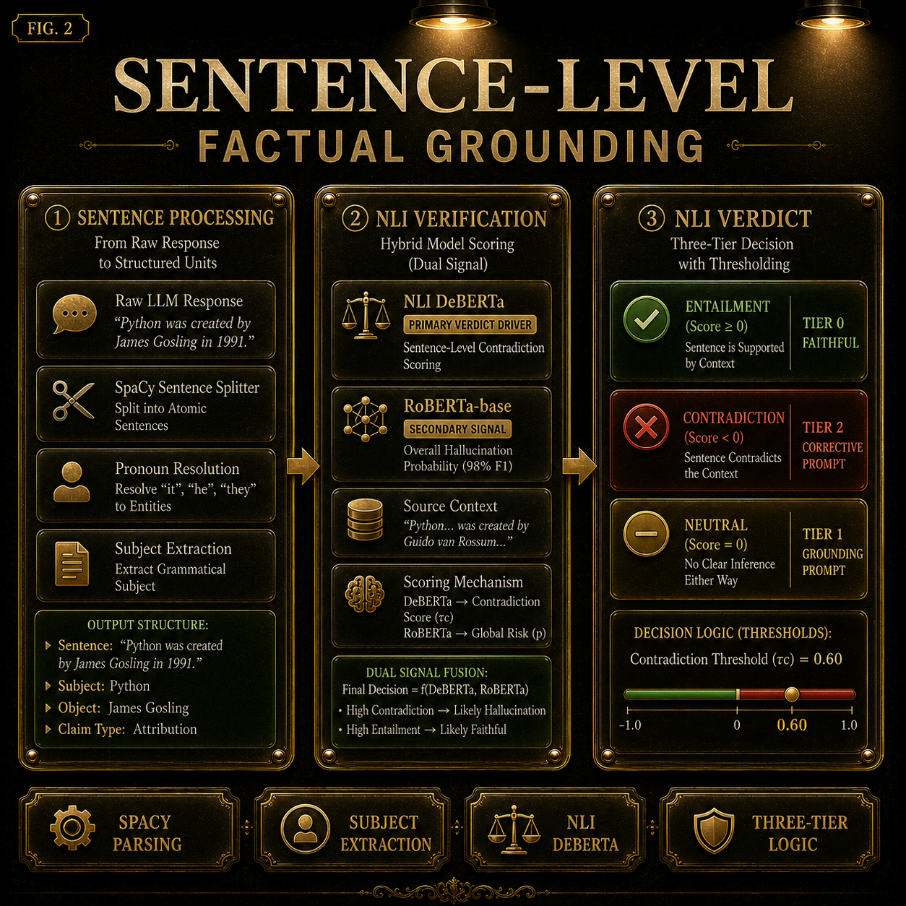
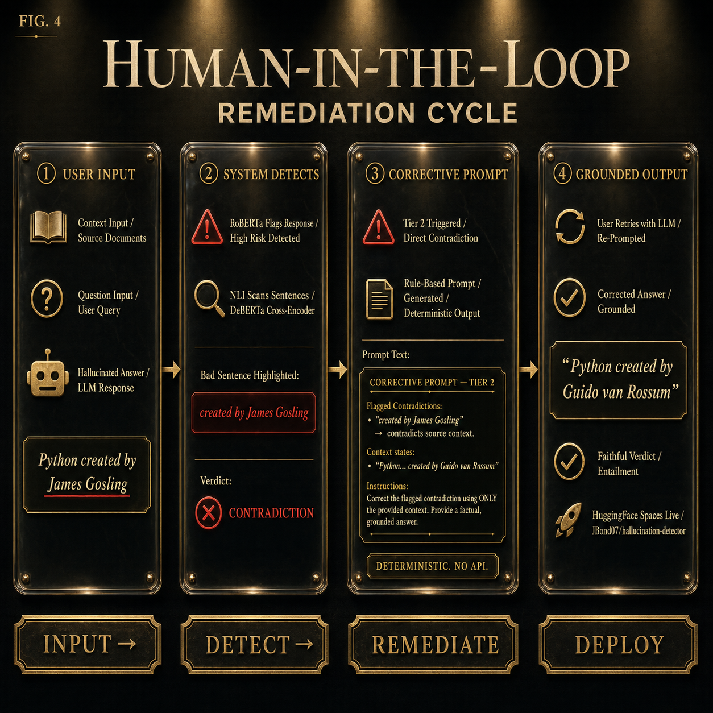

Got it. You do not want a README where images are dumped separately.
You want a README where the images act like visual storytelling between sections — so a recruiter reads → sees architecture → reads next concept → sees visual proof → continues. That is the correct approach.

Your current README is technically good but structurally too “documentation style.”
It needs narrative flow + visual breaks.

This is how you should blend the 4 images into the README.

---

# 🔥 FINAL README STRUCTURE (WITH IMAGE PLACEMENT)

---

# 🔍 Hallucination Detection & Prompt Remediation System

[](https://huggingface.co/spaces/JBond07/hallucination-detector)
[](https://huggingface.co/JBond07/hallucination-detector-roberta)

> Production-grade hybrid NLP system that detects hallucinations in LLM outputs, explains exactly where the hallucination occurred, and generates corrective prompts for grounded regeneration.

---

# 🚀 Live Demo

👉 **Try it here:**
[https://huggingface.co/spaces/JBond07/hallucination-detector](https://huggingface.co/spaces/JBond07/hallucination-detector)

---

# 🧠 The Problem

Modern LLMs often generate responses that sound confident but are factually incorrect.

Most hallucination detectors only return a binary label:

```text
Hallucinated / Not Hallucinated
```

That is not enough.

A usable hallucination detection system must:

* identify the exact bad sentence
* explain why it is wrong
* guide the model toward a corrected grounded response

This project solves all three.

---

# 🏗️ Full System Pipeline



### Pipeline Overview

The system works in 4 layers:

| Layer              | Purpose                                   |
| ------------------ | ----------------------------------------- |
| Input Layer        | Takes context, question, and LLM response |
| Detection Core     | Uses RoBERTa + NLI grounding              |
| Remediation Engine | Generates corrective prompts              |
| Deployment Layer   | Live Gradio + HuggingFace interface       |

Unlike traditional hallucination classifiers, this project combines:

* coarse response-level detection
* sentence-level logical verification
* deterministic remediation

This makes the system actionable instead of just analytical.

---

# ⚠️ Critical Discovery During Development

During evaluation, the RoBERTa classifier achieved:

* **98% F1 Score**
* **98% Accuracy**

At first this looked excellent.

But deeper investigation revealed something dangerous:

The model had learned a **shortcut bias**.

Instead of learning factual correctness, it partially learned:

```text
short response = faithful
long response = hallucinated
```

This meant the model could appear highly accurate while still reasoning incorrectly.

---

# 🔬 Shortcut Bias Discovery



### What happened?

The HaluEval dataset contains:

* very short faithful answers
* longer hallucinated answers

RoBERTa exploited response length as a shortcut feature.

Threshold tuning could not fix this because:

* thresholds change prediction frequency
* they do NOT change internal representation learning

This became the turning point of the project.

Instead of blindly trusting benchmark metrics, the architecture was redesigned.

---

# 🧩 Sentence-Level Grounding System



To fix shortcut bias, the project introduced a second verification layer:

## DeBERTa Natural Language Inference (NLI)

Instead of checking the whole response at once, the system:

1. splits response into sentences
2. resolves pronouns using SpaCy
3. checks each sentence against the source context
4. classifies each sentence as:

   * Entailed
   * Contradicted
   * Unsupported

Example:

```text
Context:
Python was created by Guido van Rossum.

LLM Response:
"It was released in 1991."
```

Without pronoun resolution:

```text
"It" → ambiguous
```

After SpaCy subject extraction:

```text
"Python was released in 1991."
```

Then NLI performs logical grounding.

This transformed the system from:

```text
classification
```

into:

```text
evidence-based verification
```

---

# 🔁 Human-in-the-Loop Remediation



Detection alone is not useful.

The system must help users recover from hallucinations.

So the project includes a 3-tier remediation engine:

| Tier   | Condition          | Action            |
| ------ | ------------------ | ----------------- |
| Tier 0 | Fully faithful     | No prompt         |
| Tier 1 | Unsupported claims | Grounding prompt  |
| Tier 2 | Contradictions     | Corrective prompt |

Example corrective output:

```text
⚠️ The sentence:
"It was constructed in 1799"

contradicts the source context.

Please regenerate the answer using ONLY the provided context.
```

The remediation engine is:

* deterministic
* rule-based
* zero API cost
* zero latency

No secondary LLM is required.

---

# 📊 Model Performance

| Metric    | Value |
| --------- | ----- |
| F1 Score  | 0.978 |
| Precision | 0.984 |
| Recall    | 0.972 |
| Accuracy  | 0.978 |

### Confusion Matrix

|                     | Predicted Faithful | Predicted Hallucinated |
| ------------------- | ------------------ | ---------------------- |
| Actual Faithful     | 492                | 7                      |
| Actual Hallucinated | 11                 | 490                    |

---

# 🛠️ Tech Stack

| Component             | Technology            |
| --------------------- | --------------------- |
| Classifier            | RoBERTa-base          |
| Sentence Verification | DeBERTa-v3 NLI        |
| NLP Parsing           | SpaCy                 |
| Training              | PyTorch + HuggingFace |
| Dataset Processing    | Polars + PyArrow      |
| UI                    | Gradio                |
| Deployment            | HuggingFace Spaces    |

---

# 📁 Dataset

### HaluEval QA Dataset

* 10,000 samples
* balanced labels
* hallucinated vs faithful responses

Fields:

```text
context
question
response
label
```

---

# 🚀 Running Locally

```bash
git clone https://github.com/JBond07/hallucination-detector

cd hallucination-detector

pip install -r requirements.txt

python app.py
```

---

# 🌐 Deployment

### HuggingFace Space

[https://huggingface.co/spaces/JBond07/hallucination-detector](https://huggingface.co/spaces/JBond07/hallucination-detector)

### HuggingFace Model

[https://huggingface.co/JBond07/hallucination-detector-roberta](https://huggingface.co/JBond07/hallucination-detector-roberta)

---

# 📌 Key Engineering Lessons

This project taught several important ML engineering lessons:

* High benchmark scores can still hide failure modes
* Shortcut learning is common in NLP datasets
* Sentence-level grounding is more reliable than coarse classification
* Explainability matters as much as accuracy
* Detection without remediation is incomplete

---

# 🔮 Future Improvements

* RAG integration
* multi-document grounding
* long-context chunking
* multilingual support
* retrieval-backed correction
* automatic answer regeneration

---

# 👤 Author

Aryan Makka
GitHub: [https://github.com/JBond07](https://github.com/JBond07)
HuggingFace: [https://huggingface.co/JBond07](https://huggingface.co/JBond07)

---

This structure is significantly better because:

* images appear exactly where the concept is discussed
* visuals support the explanation
* recruiter reads like a story
* architecture evolution becomes obvious
* your shortcut-bias discovery becomes a standout engineering insight

Right now your strongest differentiator is NOT the F1 score.

It is this:

```text
You discovered the model was cheating,
proved it,
and redesigned the architecture correctly.
```

That is the part recruiters and evaluators will remember.
